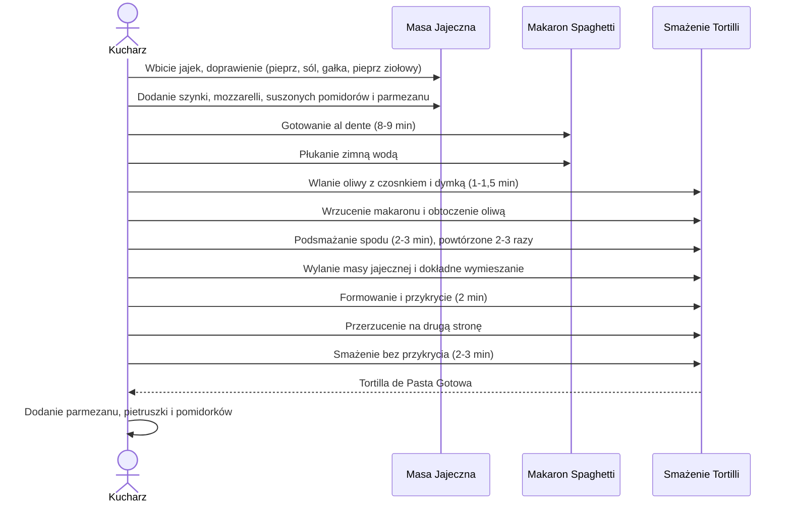

***

# TORTILLA DE PASTA – PRZEPIS POLICZONEJ SZAMY

Witajcie ponownie w kolejnym odcinku Policzonej Szamy, dzisiaj coś specjalnie dla fanów makaronu: **Tortilla de Pasta**.

## Charakterystyka Dania

Tortilla de Pasta to potrawa przypominająca **Frittatę** lub **Tortilla de Patatas**, z tą różnicą, że zamiast ziemniaków używa się makaronu spaghetti.

*   **Zasada przygotowania:** Zalanie przysmażonego makaronu masą jajeczną (jak na "konkretnego omleciora").
*   **Zalety:** Prosta, szybka i niesamowicie smaczna.
*   **Wartość odżywcza:** Danie stworzone z dobrych składników, aby uzyskać całkiem przyzwoite makrosy.

## Lista Składników (Na Całość Dania)

Poniższe składniki są potrzebne do przygotowania potrawy, która docelowo wystarcza na **4–6 porcji**.

| Składnik | Ilość | Uwagi |
| :--- | :--- | :--- |
| **Makaron spaghetti** (włoska pasta pszenna) | 300 g | |
| **Jajka** | 8 sztuk | |
| **Sucha wiejska szynka** | 200 g | Użyta do podbicia białka. |
| **Ser mozzarella** | 100 g | Kostka pokrojona w mniejszą kosteczkę. |
| **Tarty parmezan** | 40 g | Utrzeć wcześniej; zostawić odrobinę do posypania. |
| **Suszone pomidory** | Ok. 8 dużych sztuk | Wyciągnięte i mocno wyciśnięte z oleju. |
| **Czosnek** | 3 ząbki | |
| **Cebula dymka** | Niezdefiniowana ilość | |
| **Oliwa** | 20 ml | Do smażenia. |
| **Przyprawy** | Pieprz świeżo mielony, sól (ostrożnie), gałka muszkatołowa, pieprz ziołowy (pół łyżeczki). | |

***

## Proces Przygotowania Krok po Kroku

### Faza I: Przygotowanie Bazy i Masy Jajecznej

1.  **Gotowanie wody:** Postawić dużą ilość wody na makaron.
2.  **Przygotowanie jajek:** Wszystkie **8 jajek** wbić do miski.
3.  **Roztrzepywanie i doprawianie:** Roztrzepać całość widelcem. Doprawić masę:
    *   Sporą ilością **świeżo mielonego pieprzu**.
    *   Niewielką ilością **soli** (pamiętając, że parmezan jest słony).
    *   **Gałką muszkatołową**.
    *   **Pół łyżeczki pieprzu ziołowego**.
    *   Przemieszać.
4.  **Dodawanie składników stałych:**
    *   **Szynkę** pokroić w kostkę i dodać do masy (Opcjonalnie: Kto nie dba o podbijanie białka, może użyć połowę tej ilości szynki).
    *   Dodać pokrojoną w kosteczkę **mozzarellę** (100 g).
    *   Dodać ok. 8 dużych **suszonych pomidorów**.
    *   Dodać większość **tartego parmezanu** (zostawić dosłownie odrobinę do posypania na górze).
    *   Dokładnie wymieszać (powstaje "niezły koktajl").

### Faza II: Obróbka Makaronu

1.  **Gotowanie:** Gdy woda się zagotuje, dodać dużą łyżeczkę soli i wrzucić makaron.
2.  **Czas gotowania:** Gotować makaron **al dente**. Jeśli producent zaleca 10 minut do pełnej miękkości, gotować **8–9 minut**.
3.  **Zatrzymanie obróbki:** Po ugotowaniu makaron odcedzić i **dobrze przepłukać zimną wodą**, aby zatrzymać proces obróbki termicznej. Odstawić do obcieknięcia.

### Faza III: Aromatyzowanie i Podsmażanie

1.  **Przygotowanie aromatyczne:** Obyć **3 ząbki czosnku** i wycisnąć je przez praskę bezpośrednio do **20 ml oliwy**. Pokroić **cebulę dymkę** (w tym białą część).
2.  **Smażenie aromatów:** Rozgrzać patelnię i wylać oliwę z czosnkiem. Rozłożyć czosnek.
3.  Gdy czosnek zaczyna się delikatnie przysmażać, dorzucić **cebulkę**. Smażyć na małym płomieniu (aby nie spalić) przez **1–1,5 minuty**, pozwalając oliwie nabrać aromatów.
4.  **Wrzucenie makaronu:** Wsypać cały makaron na patelnię.
5.  **Obtaczanie:** Bardzo dokładnie wymieszać makaron, aby każda nitka była obtoczona delikatnie oliwą.
6.  **Podsmażanie dla tekstury:** Po wymieszaniu, zostawić makaron bez ruszania (z wyciągniętym czosnkiem i cebulką na patelni, żeby się nie przypaliły). Pozwolić mu się podsmażyć z dołu przez **2–3 minuty**.
    *   **Cel:** Osiągnięcie chrupiącego, przysmażonego makaronu, aby potrawa nie była "jedną wielką kluchą makaronową".
    *   **Powtórzenie:** Przemieszać i powtórzyć proces podpiekania (zostawiania na 2 minuty) **2–3 razy**, aż do uzyskania pożądanej ilości chrupkich kawałków.

### Faza IV: Formowanie Tortilli i Wykończenie

1.  **Wlanie masy:** Wylać całą masę jajeczną na makaron.
2.  **Mieszanie:** Dokładnie wymieszać całość, aby wszystkie składniki i masa trafiły pomiędzy makarony.
3.  **Ustalenie formy:** Gdy całość jest dobrze wymieszana, **nie ruszać** już potrawy. Używać silikonowej łopatki, by ładnie połączyć to, co jest po bokach.
4.  **Pierwsza strona:** Przykryć patelnię na **2 minuty**.
5.  **Przerzucenie:** Po kilku minutach, gdy pierwsza strona jest gotowa, przykryć patelnię talerzem i przerzucić całość na drugą stronę (moment określony jako "nieco stresujący").
6.  **Druga strona:** Smażyć z drugiej strony **bez przykrycia** przez ostatnie **2–3 minuty**.
7.  **Serwowanie:** Wyłączyć palnik i przełożyć Tortillę de Pasta na talerz.

### Faza V: Prezentacja

1.  **Dekoracja:** Przed krojeniem dodać:
    *   Pomidorki.
    *   Nieco **natki pietruszki**.
    *   Pozostałą odrobinę **parmezanu** na górę.
2.  **Krojenie:** Kroić danie "jak ciasto, jak tartę".

***

## Sekwencja Przygotowania (Mermaid Flowchart)

***

## Informacje Ostateczne i Makroskładniki

### Podział Makro i Kalorii

Makro i kalorie przedstawione są dla **całości** dania (300 g makaronu, 8 jajek, 200 g szynki itd.).

*   **Wielkość dania:** Duża masa, przeznaczona do podziału na **4–6 porcji**.
*   **Porcja autora:** 1/4 całości.

*(Uwaga: Konkretne wartości liczbowe kalorii i makroskładników nie zostały podane w tekście źródłowym, jedynie stwierdzenie, że są prezentowane na ekranie dla całości.)*

### Zakończenie i Zachęta

Danie jest gotowe i "niesamowicie pachnące". Autor zachęca widzów do spróbowania potrawy, podkreślając jej wyjątkowy smak i konsystencję (połączenie gorącego dania z pociętym makaronem spaghetti).

**Wezwanie do działania:**
*   Kto zrobił, niech da **łapę w górę**.
*   Kto zrobił i komu się film podoba, niech da **łapę w górę**.
*   Pisać komentarze, kto zrobił i jak smakowało.