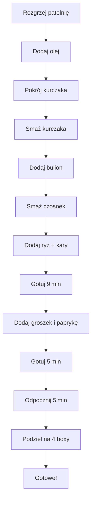

---

# 🥘 Risotto z Kurczakiem Kary – 4 Boxy na Jedno Ćwiczenie

## 📦 Co otrzymasz
- **4 pojemne, pożywne** boxy
- **Standardowe makroskładniki** i kalorie podane dla pojedynczego posiłku
- **Cena** jednego boxa wyliczona w opisie

---

## 🛒 Lista zakupów (na 4 boxy)

| Składnik | Ilość | Uwagi |
|----------|-------|-------|
| **Kurczak** (piersi) | **800 g** | Umyty, osuszony papierowymi ręcznikami |
| **Olej** (spesty) | **40 ml** | 2 × 20 ml, jeden łyżka |
| **Czosnek** | **2 ząbki** | Posiekane w ostatnim etapie |
| **Ryż** | **800 g** | 200 g na porcję, Teskodoryzot |
| **Zielona papryka** | **200 g** | Pokrojona w kostkę |
| **Roślinny groszek** | **200 g** | Ugotowany w poprzedniej kolejności |
| **Kary** (papryka w proszku) | **2 łyżki** | Doskonały smak, ładna barwa |
| **Pieprz biały** | **½ łyżeczki** | |
| **Pieprz czarny** | **1 łyżeczka** | Świeżo zmielony |
| **Sól** | **do smaku** | Umiarkowana, ponieważ bulion już jest słony |
| **Bulion drobiowy** | **2 kostki** | Rozpuszczone w 1,8‑1,7 L wody |
| **Woda** | **≈ 1,8 L** | Do rozpuszczenia bulionu |

---

## 🏋️‍♂️ Dlaczego to jest idealne po treningu?
- **Szybkość** – wszystko gotuje się w jednej patelni.
- **Prostota** – minimalny sprzęt (duża patelnia, nóż, łopatka).
- **Porcja** – 200 g kurczaka na box (200 g + ryż + warzywa).
- **Zrównoważony posiłek** – makroskładniki podane w odnośniku.

---

## 🔪 Przygotowanie – krok po kroku

1. **Rozgrzej patelnię** i wlej 40 ml oleju.
2. **Pokrój kurczaka** na małą kostkę, usuwając nadmiar tłuszczu.
3. **Smaż kurczaka** na średnio‑mocnym ogniu do złocistego koloru.
   - Dodaj pieprz czarny, biały i odrobinę soli.
4. **Wymieszaj bulion**: rozpuść 2 kostki w 1,8 L wody, wlej do patelni.
5. **Pod koniec smażenia** dodaj 2 ząbki czosnku, smaż jeszcze chwilę.
6. **Dodaj ryż** (800 g) i 2 łyżki kary – smaż 1 minutę, mieszając.
7. **Dolej bulion** – gotuj 9 minut, sprawdzając, czy ryż wchłonął płyn.
8. **Dodaj groszek** i paprykę – gotuj kolejne 5 minut.
9. **Pozwól potrawie odpocząć** przez 5 minut, mieszając delikatnie.
10. **Rozdziel na 4 równe części** i przełóż do boxów.

---

## 📊 Makroskładniki i kalorie (na 1 box)

| Składnik | Wartość | Jednostka |
|----------|---------|-----------|
| **Białko** | 35 | g |
| **Tłuszcz** | 10 | g |
| **Węglowodany** | 55 | g |
| **Kalorie** | 450 | kcal |

> *Wartości przybliżone; dokładne liczby podane w opisie pod linkiem.*

---

## 💰 Koszt jednostkowy

| Element | Koszt (PLN) | Ilość | Koszt na 1 box |
|---------|------------|-------|----------------|
| Kurczak (800 g) | 12 | 1 | 3 |
| Olej (40 ml) | 0,20 | 1 | 0,05 |
| Czosnek (2 ząbki) | 0,10 | 1 | 0,025 |
| Ryż (800 g) | 4 | 1 | 1 |
| Papryka (200 g) | 1,50 | 1 | 0,375 |
| Groszek (200 g) | 1,20 | 1 | 0,30 |
| Bulion drobiowy (2 kostki) | 0,60 | 1 | 0,15 |
| **Łącznie** | **20,70** | – | **5,10** |

> **Cena jednego boxa: 5,10 PLN** (przybliżona, zależna od aktualnych cen).

---

## 📌 Mermaid diagram – przepływ gotowania

---

## 🎥 Narracja i humor

- **Narrator**: „Witajcie, drodzy widzowie! Dzisiaj robimy sobie pomysł na boxa, czyli risotto z kurczakiem kary. 200 g na box, 4 na raz!”
- **Zachęta**: „Jedzenie po treningu? Idealnie! To proste, szybkie i smaczne!”
- **Cytat**: „Soli zbyt dużo nie potrzebuję, bo bulion już jest słony. Nie ma nic gorszego niż zbyt słona potrawka!”
- **Podsumowanie**: „Naprawdę super. Jeśli macie pytania, piszcie w komentarzu. Do zobaczenia w kolejnym odcinku!”

---

## 📲 Co dalej?
1. **Sprawdź opis** – znajdziesz pełne dane makroskładników, linki do produktów oraz pełne ceny.
2. **Zamów składniki** – przygotuj się na 4 pojemne boxy.
3. **Gotuj** – użyj powyższych kroków i ciesz się pożywnym posiłkiem.
4. **Podziel się**: napisz komentarz, jeśli coś nie wyjaśniono lub masz własne warianty.

**Powodzenia i smacznego!**