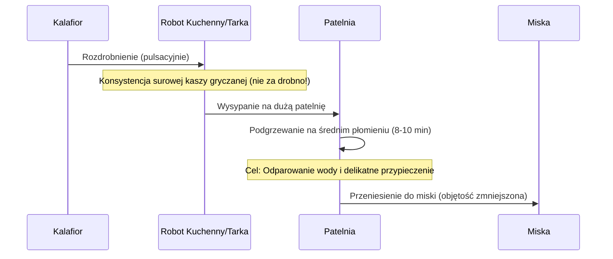

***

# Przepis na Pizzę z Kalafiora (Niskowęglowodanowy Spód)

Witajcie ponownie na kanale **POLICZONA SZAMA**. Ja jestem Mateusz i pokażę Wam, jak przygotować **spód kalafiorowy** do pizzy – jest on przepyszny, zwarty i **niskowęglowodanowy**. Jest to idealna opcja do diet **LOW CARB**, a nawet **ketogenicznych**, charakteryzująca się dużą ilością białka. Zobaczycie również, jak przygotować do tego idealny sos pomidorowy.

> **Uwaga:** Mało kto odgadłby, że ta pizza zrobiona jest z kalafiora.

## I. Przygotowanie Aromatycznego Sosu Pomidorowego

Przygotowanie sosu można rozpocząć równolegle z robieniem spodu kalafiorowego.

### Składniki na Sos

| Składnik | Ilość |
| :--- | :--- |
| Oliwa | 10 ml |
| Czosnek | 2 duże ząbki |
| Suszona bazylia | 1 łyżka |
| Suszone oregano | 1 łyżka |
| Przecier pomidorowy (kartonik) | 500 g |
| Sól | Do smaku |

### Proces Przygotowania

1.  **Rozgrzewanie i Czosnek:** Do rondelka wlej 10 ml oliwy. Rozgrzej ją i wyciśnij dwa duże ząbki czosnku.
2.  **Aktywacja Aromatów:** Podsmaż czosnek delikatnie. Dodaj zioła (bazylia i oregano w stosunku 1:1, po łyżce). Podsmażaj delikatnie z czosnkiem, aby aromaty się aktywowały.
3.  **Dodanie Przecieru:** Dolej cały kartonik przecieru pomidorowego (500 g).
4.  **Doprawianie i Mieszanie:** Dokładnie przemieszaj i dodaj nieco soli.
5.  **Gotowanie i Redukcja:** Kiedy sos zaczyna się gotować, przykryj rondelek (ponieważ zaczyna chlapać). Gotuj na wolnym ogniu przez **10–12 minut**.

> **Cel redukcji:** Zależy nam na zredukowaniu sosu i odparowaniu wody, dlatego gotuj z **uchyloną pokrywką**.

**Rezultat:** Po paru minutach sos zgęstnieje, osiągając idealną konsystencję. Gotowy sos przelej do miski.

### Wykorzystanie Sosu

*   **Do pizzy:** Na jedną pizzę wykorzystana zostanie około **1/4** przygotowanego sosu (może też posłużyć do polania na górę).
*   **Reszta:** Resztę sosu można wykorzystać do innych dań, np. makaronu lub zapiekanek.

## II. Spód Kalafiorowy: Gwóźdź Programu

Przepis jest **znormalizowany** na jedną osobę/jedną pizzę.

### Składniki na Spód Niskowęglowodanowy

| Składnik | Ilość |
| :--- | :--- |
| Kalafior | 250–300 g |
| Parmezan | 50 g |
| Jajko | 1 spore wiejskie jajko |
| Oregano | Odrobina (później 1 łyżeczka) |

### Proces Przygotowania Kalafiora (Rozdrabnianie i Odwadnianie)

Poniższy diagram przedstawia sekwencję przygotowania kalafiora do ciasta:

1.  **Rozdrabnianie:** Kalafiora włóż do robota i rozdrobnij pulsacyjnie (dosłownie parę sekund).
    *   *Alternatywa:* Jeśli nie masz miksera, użyj tarki na dużych oczkach.
    *   *Kluczowa zasada:* Ważne, aby nie rozdrobnić kalafiora zbyt mocno. Kawałki powinny być wielkości mniej więcej surowej, nieugotowanej kaszy gryczanej.
2.  **Odwadnianie/Podsuszanie:**
    *   Weź dużą patelnię (o jak największej powierzchni) i wysyp na nią rozdrobnionego kalafiora.
    *   Na średnim płomieniu podgrzewaj i delikatnie przypiekaj przez **8–10 minut**.
    *   Celem jest pozbycie się wody z warzywa. Gdy patelnia jest mocno nagrzana, kalafior zaczyna parować.
    *   *Efekt smakowy:* Część kalafiora delikatnie się przysmaży, co nie przeszkadza, a wręcz polepsza delikatnie smak ciasta.

## III. Mieszanie Ciasta i Wstępne Pieczenie Spodu

### Tworzenie Ciasta

1.  **Mieszanie Składników:** Podsuszony kalafior przenieś prosto do miski (jego objętość nieco się zmniejszy po odparowaniu wody).
2.  **Dodatki:** Wetrzyj parmezan na małych oczkach. Dodaj **łyżeczkę oregano** i wbij jajko.
3.  **Wyrabianie:** Wymieszaj wszystko dokładnie, tworząc jednolite ciasto na spód pizzy.

### Wstępne Pieczenie

1.  **Piekarnik:** W tym czasie rozgrzej piekarnik do **200 stopni (termoobieg)**.
2.  **Formowanie:** Przygotuj blachę wyłożoną papierem do pieczenia. Wyłóż ciasto na sam środek. Delikatnie ugniataj, rozpłaszczaj i formuj kształt pizzy.
    *   Moja pizza ma **24 cm średnicy**.
3.  **Pieczenie Wstępne:** Włóż blachę na **środkowy poziom**.
    *   Piecz spód przez mniej więcej **10 minut** (do ładnego zarumienienia się).
    *   *Cel:* Uformowanie spodu w stałą masę.

## IV. Kompletowanie i Finalne Pieczenie

W czasie pieczenia wstępnego można przygotować resztę składników i dodatków.

### Składniki na Wierzch

Oprócz przygotowanego sosu pomidorowego, do pizzy dodaję:

*   Tarta mozzarella (z kostki): **30 g**
*   Wiejska sucha szynka: **30 g**
*   Świeża mozzarella: **Pół kulki** (poszarpana)
*   Rukola: Na górę (dodawana po pieczeniu, aby "dodać 2% do zdrowotności").

### Technika Pieczenia Końcowego

1.  **Sprawdzenie Spodu:** Po 10 minutach spód jest gotowy – stanowi stałą masę i można go bez problemu podnieść z papieru.
2.  **Usunięcie Zaparu (Myk):** Aby spód jeszcze bardziej przypominał prawdziwy spód pizzy i odparował resztę wody, zdejmij go z papieru do pieczenia. Pizza będzie kończyć pieczenie na **ruszcie**.
3.  **Nakładanie Dodatków:** Wyłóż na spód: sos pomidorowy, tartą mozzarellę, kawałki szynki i poszarpaną kulkę świeżej mozzarelli.
4.  **Pieczenie Finalne:** Włóż pizzę do piekarnika na **górny poziom**. Tym razem użyj grzania **góra-dół**.
    *   *Cel:* Aby tylko górna grzałka dobrze stopiła i podgrzała ser oraz całą pizzę.
    *   *Czas:* Dosłownie **3–4 minuty**.

## V. Prezentacja i Degustacja

Pizza jest gotowa. Wyłóż ją z rusztu na talerz. Na górę dodaj rukolę.

### Wrażenia i Właściwości

*   **Wygląd:** Świetnie przypieczone ranty.
*   **Konsystencja:** Pizza jest **cieniutka** i **trzyma swoją formę**.
*   **Smak:** Przepyszna. Kalafior sam w sobie jest bardzo słabo, praktycznie w ogóle **niewyczuwalny**.

> **Ocena wizualna:** Z odległości 1-2 metrów nikt nie zorientowałby się, że spód zrobiony jest z kalafiora.

Nie pozostaje nic innego, jak pokroić na kawałki i spróbować! Pizza znika bardzo szybko.

### Informacje Końcowe

*   Podane są makrosy i kalorie na jedną taką pizzę (dla widza).
*   **Zachęta:** Łapka w górę, pisanie komentarzy i do zobaczenia w kolejnym odcinku!