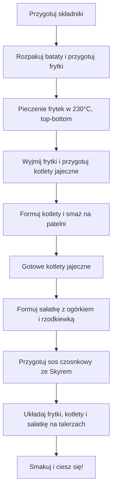

---  

## 1. Witajcie moi drodzy w kolejnym przepysznym odcinku!  

> **Policzonej Szamy** – wspaniały show, gdzie gotowanie spotyka się z pasją i humorem.  

> **No witajcie moi drodzy w kolejnym przepysznym odcinku** – bo kto nie lubi, kiedy w kuchni panuje lekka ironia?  

> **Składniki**: 4 jajka twarde, 1 jajko surowe, 100 g pieczarek, 40 g sera cheddar, 30 g bułki tartej, 25 g musztardy (opcjonalnie, ale u mnie standard), 10 ml oliwy, mieszanka papryk, 600 g batatów, ogórek, rzodkiewka, szczypiorek, 200 ml Skyr, czosnek, oregano, bazylia – wszystko jest już podane!

---

## 2. Składniki – co w garnku i na talerzu?  

| Składnik | Ilość | Uwagi |
|---|---|---|
| **4 jajka twarde** | 4 | Ugotowane wcześniej na twardo |
| **1 jajko surowe** | 1 | Na wyluzowane, bo kto nie lubi czegoś ekstra? |
| **Świeże pieczarki** | 100 g | Dobre do kotletów |
| **Ser cheddar** | 40 g | Tego ma być chrupiący i aromatyczny |
| **Bułka tarta** | 30 g | Brak potrzeby głębokiego smażenia, ale chęć chrupkości |
| **Musztarda (opcjonalna)** | 25 g | U mnie standard, bo smakuje! |
| **Sól** | Do smaku | Mniej, bo w końcu jajka i musztarda już „naładowane” |
| **Pieprz** | Do smaku | Złóżmy nieco ostrości |
| **Olive oil** | 10 ml | Minimalnie, bo kotlety mają być lekko maślane |
| **Papryka słodka, ostra, chili** | Mieszanka | Nie określono proporcji – po własnym uznaniu |
| **Bataty** | 600 g | Dla 2 porcji, pokrojone na 1,5 cm |
| **Czosnek** | 1 ząbek | Do sosu – bezpośrednio przez praskę do Skyra |
| **Suszone zioła (oregano, bazylia)** | Do smaku | Dodają aromatu |
| **Ogórek świeży** | 1 | Do sałatki |
| **Rzodkiewka** | Kilka | Do sałatki |
| **Szczypiorek** | Do smaku | Dodatkowa świeżość |
| **Skyr** | 200 ml | Na bazę do sosu czosnkowego |
| **Zielona cebulka** | Do smaku | Dla koloru i świeżości |

> **Makro na dole** – informacja, że w kolejnym odcinku podam dokładne wartości kaloryczne i makroskładniki (bez liczb, bo jeszcze nie zostały obliczone).

---

## 3. Przygotowanie frytek z batatów  

1. **Rozgrzewamy piekarnik** – 230 °C, top‑bottom, bez konwekcji (bo to jest klasyka, a nie nowy trend).  
2. **Blacha** – wyłóż papierem do pieczenia.  
3. **Rozkładamy bataty** – pokrojone na plastry 1,5 cm grubości.  
4. **Polewamy oliwą** – 10 ml na całą porcję.  
5. **Mieszamy papryki** – słodka, ostra i chili w jedną małą mieszankę (proporcje według smaku).  
6. **Przerzucamy** – na blachę, w równomierne warstwy, by się równomiernie upiekły.  
7. **Piecimy** – 230 °C, top‑bottom, bez konwekcji.  

---  

## 4. Przygotowanie kotletów jajecznych  

1. **Wyjmujemy żółtka** z 4 twardych jajek – zostawiamy je w koszulce, aby później były „na namoczonym” sosem.  
2. **Tnijemy pieczarki** – 100 g świeżych pieczarek, drobno posiekane.  
3. **Tnijemy ser cheddar** – 40 g, aby szybko się roztopił.  
4. **Zacieramy** – żółtka, 1 jajko surowe, 30 g bułki tartej, 25 g musztardy (opcjonalnie, ale u mnie standard), sól i pieprz.  
5. **Dodajemy** – szczypiorek i ser cheddar, a całość delikatnie mieszan.  
6. **Formujemy** – 4 kotlety (po jednym jajku na kotlet).  
7. **Przygotowujemy patelnię** – rozgrzewamy na średnim ogniu, dodajemy minimalne 1-2 łyżeczki oliwy (taka, by lekko maślały).  

---

## 5. Gotowanie kotletów jajecznych  

1. **Pierwsza strona** – 2–3 min, pokrywamy patelnią (to daje „miękki, soczysty” efekt).  
2. **Otwieramy** – drugą stronę, smażymy kolejnych 2–3 min bez pokrycia, by uzyskać chrupiącą skórkę.  

> **No witajcie moi drodzy** – a oto kotlety jajeczne w pełni gotowe!  

---

## 6. Przygotowanie sałatki i sosu czosnkowego ze Skyra  

1. **Część sałatki**  
   - 1 ogórek świeży, pokrojony  
   - Kilka rzodkiewek, pokrojone  
   - Reszta szczypiorku, do dekoracji  
2. **Sos czosnkowy**  
   - 200 ml Skyr  
   - 1 ząbek czosnku, rozgnieciony praską (zatrzaskujemy na „mocno czosnkowy” efekt)  
   - Suszone zioła: oregano, bazylia (do smaku)  
   - Mieszamy dokładnie – to „podbije białko” i podkreśli smak.  

---

## 7. Układanie dania i podsumowanie  

1. **Frytki** – podzielone na dwa talerze (2 porcje).  
2. **Kotlety jajeczne** – podane na talerzu, pokryte sosem czosnkowym i świeżą zieleniną.  
3. **Sałatka** – z ogórkiem, rzodkiewką, szczypiorkiem i sosem czosnkowym, stanowiąca dodatkowy kolor i chrupkość.  

> **Makro, kalorie** – jeden posiłek to po prostu eksplozja smaku, a „policzę” później.  

---

## 8. Smak i podsumowanie  

- **Kotlety jajeczne** – miękki, soczysty, delikatny, ale jednocześnie niesamowicie smakowy.  
- **Frytki z batatów** – słodkie, słodko‑pikantne, chrupiące.  
- **Sos czosnkowy ze Skyrem** – podbija białko, jest mocno czosnkowy, super!  

> **No to co?** – Widzimy się w kolejnym odcinku, do zobaczenia, cześć!  

---

## 9. Flowchart: Cały proces (Mermaid)

---  

> **No witajcie moi drodzy** – gotowe, smacznie i zawsze z uśmiechem!