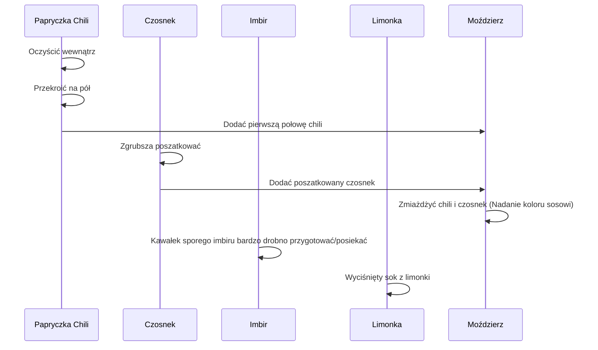

***

# PRZEPIS NA SOS SŁODKIE CHILI: SZYBKI I TREŚCIWY ODCINEK

Przed wami szybki i treściwy odcinek poświęcony przygotowaniu **sosu słodkie chili**. Jest to idealne połączenie słodkości, pikantności oraz delikatnej nuty kwaskowatości, które sprawdzi się doskonale nie tylko do sajgonek, ale również do wielu innych potraw – wszędzie tam, gdzie te smaki uznacie za pasujące.

## I. Wymagane Składniki

Poniżej przedstawiono listę wszystkich niezbędnych składników, które będą potrzebne do przygotowania sosu.

| Składnik | Ilość | Cel/Uwagi |
| :--- | :--- | :--- |
| Papryczka chili | 1 sztuka | Dobrze oczyszczona wewnątrz. |
| Czosnek | 2 ząbki | Do zmiażdżenia w moździerzu. |
| Limonka | 1 sztuka | Wykorzystujemy sok. |
| Imbir | Kawałek | Spory kawałek, do bardzo drobnego posiekania. |
| Woda | 200 ml | Baza sosu. |
| Cukier | 60 g | Element słodkości. |
| Ocet ryżowy | 2 łyżeczki | Zapewnia kwaskowatość. |
| Sos rybny | 1 łyżeczka | Wzmacnia smak (umami). |
| Skrobia ziemniaczana | 1 łyżeczka | Do zagęszczenia sosu. |

### Uwaga dotycząca octu

Jeśli nie możecie zdobyć **octu ryżowego**, najbardziej podobnym produktem, który można zastosować jako zamiennik, będzie **ocet jabłkowy**.

## II. Przygotowanie Wstępne Składników

Kluczowym elementem przygotowania jest odpowiednie zmiażdżenie chili i czosnku, co nada sosowi pożądany kolor i intensywność.

### Sekwencja przygotowania

Poniższy diagram przedstawia kroki przygotowania składników przed gotowaniem:

**Szczegółowe instrukcje przygotowania:**

1.  **Chili i Czosnek:** Papryczkę chili należy dobrze oczyścić wewnątrz, a następnie przekroić na pół. Pierwszą połowę wrzucamy do moździerza. Czosnek zgrubsza szatkujemy i razem z chili miażdżymy w moździerzu. Tym sposobem zmiażdżoną papryczką chili nadamy kolor naszemu sosowi.
2.  **Imbir:** Kawałek sporego imbiru również bardzo drobno preparujemy (siekanie/tarcie).
3.  **Limonka:** Przygotowujemy sok z całej limonki.
4.  **Skrobia:** Skrobię ziemniaczaną (1 łyżeczkę) mieszamy z minimalną ilością wody – będzie to potrzebne do zagęszczenia pod koniec gotowania.

## III. Proces Gotowania i Zagęszczania

Po przygotowaniu składników przechodzimy do gotowania sosu na wolnym ogniu.

1.  **Faza Wstępna:** Włączamy palnik. Wlewamy 200 ml wody do garnka.
2.  **Dodawanie Składników:** Wrzucamy wszystkie uprzednio przygotowane składniki (zmiażdżone chili i czosnek, posiekany imbir) oraz dodajemy **60 g cukru**.
3.  **Mieszanie i Gotowanie:** Mieszamy i już spokojnie na wolnym ogniu pozwalamy, by sos się gotował.
4.  **Płynne Dodatki:** Dodajemy **dwie łyżeczki octu ryżowego**, **jedną łyżeczkę sosu rybnego** oraz **wyciśniętą całą limonkę**.
5.  **Czas Gotowania:** Spokojnie zagotowujemy sos i gotujemy przez **4–5 minut**.
6.  **Zagęszczanie:** Po upływie tego czasu dodajemy jedną łyżeczkę skrobi ziemniaczanej, wcześniej wymieszaną z minimalną ilością wody.

## IV. Rezultat Końcowy

Sos jest przepyszny. Po ochłodzeniu osiąga idealną konsystencję i lepkość. Nadaje się nie tylko do sajgonek. Naprawdę go polubicie!