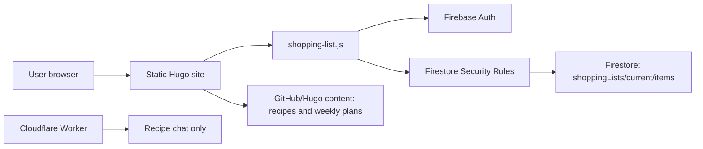

# Shopping List Architecture

This document explains the current shopping-list architecture after moving the list out of weekly-plan Markdown and into Firestore.

## Summary

The shopping list is one shared household list stored in Firebase Firestore:

- Site content stays in GitHub/Hugo: recipes, weekly plans, templates, and static assets.
- Shopping-list state lives in Firestore: current items, checked state, quantities, notes, and sources.
- Firebase Auth identifies the user in the browser.
- Firestore Security Rules decide whether that signed-in browser user can read or write the list.
- The Cloudflare Worker no longer stores weekly shopping state or commits `shopping_checked` back to GitHub.



## Main Components

### Hugo site

The static site renders:

- `/shopping-list/` as the main shopping-list page.
- Recipe pages with an add-to-shopping-list button when `shopping_ingredients` exists.
- Weekly-plan pages with an import button that adds generated plan ingredients to the current list.

The site does not store shopping-list state in generated HTML. It only sends ingredient payloads to the browser script.

### `static/js/shopping-list.js`

This is the shopping-list client. It:

- Waits for Firebase SDK/Auth/Firestore to be available.
- Signs in with Firebase Auth when needed.
- Reads and writes Firestore documents.
- Listens realtime on the shopping-list page.
- Adds manual items.
- Imports recipe ingredients.
- Imports weekly-plan ingredients.
- Merges duplicate items by deterministic document ID.

### Firestore

Current collection:

```text
shoppingLists/current/items/{itemId}
```

`itemId` is deterministic:

```text
encodeURIComponent(normalizedIngredientName + "|" + normalizedUnit)
```

That means:

- `ziemniaki | kg` becomes one document.
- Adding the same ingredient with the same unit merges quantity.
- Adding the same ingredient with a different unit creates a separate item.

Item shape:

```json
{
  "name": "ziemniaki",
  "normalizedName": "ziemniaki",
  "amount": 2,
  "unit": "kg",
  "note": "",
  "category": "Warzywa i owoce",
  "checked": false,
  "sources": [
    {
      "type": "recipe",
      "id": "domowy-doner-kebab",
      "title": "Domowy Doner Kebab",
      "url": "https://..."
    }
  ],
  "createdAt": "...server timestamp...",
  "updatedAt": "...server timestamp...",
  "updatedBy": "firebase-user-uid"
}
```

## Data Flows

### Manual item

1. User opens `/shopping-list/`.
2. User signs in if needed.
3. User adds item through the form.
4. Browser writes to Firestore.
5. Firestore rules check the request.
6. Realtime listener updates the list.

### Add recipe to list

1. Hugo renders recipe `shopping_ingredients` into a JSON payload.
2. User clicks the basket button on a recipe page.
3. `shopping-list.js` scales and imports the ingredients.
4. Existing matching items are merged by ingredient name plus unit.
5. The source is recorded as `type: "recipe"`.

### Add weekly plan to list

1. Hugo computes shopping ingredients from planned meals.
2. User clicks `Dodaj składniki z planu`.
3. The current Firestore list receives those ingredients.
4. The weekly plan remains unchanged.
5. No `shopping_checked` field is written to Markdown.

## Security Model

Firestore browser writes are protected by Firestore Security Rules, not by the Cloudflare Worker.

This is the key distinction:

- The Cloudflare Worker can read Cloudflare environment variables such as `SHOPPING_ALLOWED_USERS`.
- Firestore Security Rules cannot read Cloudflare environment variables.
- Firestore rules run inside Firebase, directly in front of the Firestore database.
- Rules only see the Firestore request, the document path/data, and Firebase Auth token data such as `request.auth.uid` and `request.auth.token`.

Current rule:

```js
match /shoppingLists/current/items/{itemId} {
  allow read, create, update, delete: if request.auth != null;
}
```

This means any signed-in Firebase user can read and write the household shopping list.

That is acceptable for a first private/family tool only if sign-in is already limited enough for your real usage. It is not a family allowlist yet.

## Family-Only Options

### Option A: Firestore allowlist documents

Recommended practical option.

Rules can check for an allowlist document:

```js
function isShoppingUser() {
  return request.auth != null
    && exists(/databases/$(database)/documents/shoppingListAccess/$(request.auth.uid));
}

match /shoppingLists/current/items/{itemId} {
  allow read, create, update, delete: if isShoppingUser();
}
```

Then an admin creates documents like:

```text
shoppingListAccess/{firebaseUid}
```

Only those UIDs can use the shopping list. The app should not expose writes to `shoppingListAccess`.

### Option B: Firebase custom claims

Good option if you are comfortable with Firebase Admin SDK.

An admin marks allowed users with a custom claim:

```json
{
  "shoppingList": true
}
```

Rules then check:

```js
allow read, write: if request.auth != null
  && request.auth.token.shoppingList == true;
```

This is clean, but requires setting claims through trusted backend/admin tooling and users may need to refresh their token after claims change.

### Option C: Hard-coded UID/email list in rules

Possible, but less nice.

Rules can check `request.auth.uid` or token email against a literal list. This is simple, but every family-member change requires editing and redeploying `firestore.rules`. Provider email behavior can also be less predictable than UID checks.

## Deploying Firestore Rules

Adding `firestore.rules` to the repo does not automatically change the live Firebase project.

The file is only local until deployed with Firebase tooling. Usual flow:

```powershell
firebase login
firebase use cookbook-ee262
firebase deploy --only firestore:rules
```

After that, Firebase applies the rules to Firestore. Hugo deployment and Cloudflare Worker deployment do not deploy Firestore rules.

## Current Limitations

- Current rules require authentication, but do not yet restrict to specific family members.
- Firestore rules are permissive about item shape. They protect access, not strict schema validation.
- The list is one shared `current` list. There is no list history or per-user list.
- Recipe and weekly-plan imports merge by ingredient name plus unit, but do not convert units.

## Recommended Next Hardening Step

Use Firestore allowlist documents:

```text
shoppingListAccess/{uid}
```

Then update rules so only those UIDs can access `shoppingLists/current/items`. This keeps family access managed inside Firebase, where the Firestore rules can actually see it.

